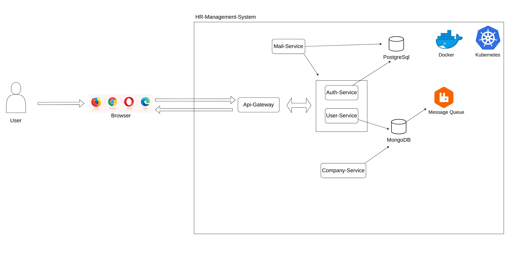

# PROJECT FLOW CHART 

# APPLICATION REQUIREMENTS AND CONFIGURATION SETTINGS

## Postgre SQL Configuration Settings
    -  url: jdbc:postgresql://localhost//ClusterIP:5432/HRMSAuthDB
    username: hrmsuser1
    password: 12345
## MongoDB Configuration Settings 
    - mongodb:
      host: localhost // ClusterIP
      port: 27017
      database: hrmsdb
      username: admin12
      password: hrms**
## Rabbit Configuration Settings
    -rabbitmq:
    host: localhost//ClusterIP
    port: 5672
    username: hrms1
    password: hrms**
    -Terminal codes for add user rabbitmq (Docker containers terminal)
    rabbitmqctl add_user newadmin s0m3p4ssw0rd
    rabbitmqctl set_user_tags newadmin administrator
    rabbitmqctl set_permissions -p / newadmin ".*" ".*" ".*"
